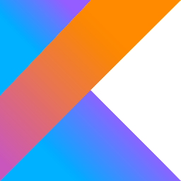

# Welcome to Shehryar Zaheer's GitHub Profile 🌟

## About Me

Hello there! 👋 I'm Shehryar Zaheer, a passionate Software Developer with a love for building beautiful and high quality android applications. I believe in the power of technology to make a positive impact on the world, and I'm always excited to explore new ideas and collaborate on innovative projects.

- 🚀 Currently working on [OgowHealth](https://ogowhealthportal.com/) at [Xeven Solutions](https://www.xevensolutions.com/)
- 🌱 I’m constantly learning and evolving in Mobile App Development.
- 💬 Let's connect! Reach out to me for discussions on Mobile Apps Development.

## My Tech Stack

Here are some of the technologies and tools I work with:

-  Android
-  Kotlin
-  Java
-  Asp .NET
-  Android Studio
-  Visual Studio

## Projects

Check out some of the projects I've been working on:

1. [Safi - Stealth Messanger](https://play.google.com/store/apps/details?id=com.sqealock.free&hl=en) - A chat app that allows users to share text, images, videos, audios and files ensuring the privacy of their data by implementing end-to-end encryptiong using RSA and AES algoriths. It also allows users to do audio/video calls using Jitsi. 

2. [OgowHealth](https://play.google.com/store/apps/details?id=com.ogowemr.health&hl=en) - A telehealth application that allows the health workers to record the patients, keep their data stored locally and sync to the server when there is a reliable internet connection using work manager. It uses Realm to store user's data locally.

3. [BARO] - A health app that provides menstruation tracking, cycle prediction, and information regarding preparation for conception, pregnancy and early motherhood. This app's UI was designed using Compose.

4. [RedHanded](https://play.google.com/store/apps/details?id=com.redhanded.app&hl=en&gl=US) - REDHANDED enables tenants and landlords to take control of their commercial real estate leasing
needs. Whether you are a landlord looking for the perfect tenant or a business owner searching for
your dream location, REDHANDED allows both parties to list, browse, and transact independently! By
cutting out the middleman, we give tenants and landlords the power to find the best solution for their businesses. REDHANDED makes the commercial real estate process transparent, simple, and enjoyable for all.

5. [iHakeem](https://play.google.com/store/apps/details?id=com.alamana.ihakeem&hl=en) - iHakeem is a telemedicine app that allows doctors to create appointments and patients can book those appointments to chat via text or audio, video calling with the doctors. Patients can also manage their EMR and connect to hardware devices like blood pressure monitor, blood sugar monitor, pulse oximiter and weight machine to record their vitals.

6. [Vision Collab](https://play.google.com/store/apps/details?id=com.imedhealth.visioncollab&hl=en) - Vision collab is a project management applications where users can manage their day to day tasks along with the tasks assigned in their specific projects. It also provides a kanban board to easily view all the tasks in a project and easily drag and drop tasks between different boards.

## Connect with Me

Let's connect and have a conversation:

-  [Twitter](https://x.com/shehryarzaheer?t=uiUBf-DM2zlUKH5vPikinw&s=08)
-  [LinkedIn](https://www.linkedin.com/in/shehryar-zaheer)
-  [Email](shehryarzaheer112@gmail.com)

## Blog

I occasionally write about my experiences, learnings, and thoughts. Check out my latest blog posts [here](https://medium.com/@shehryarzaheer112/a-better-way-to-write-migrations-in-realm-for-android-0b7d6dff39b8).

Thanks for stopping by! Feel free to explore my repositories, and don't hesitate to reach out. Let's build something amazing together! 🚀

